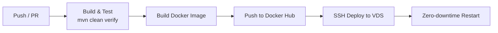

# Portfolio & QR Code Generator Service

[](https://openjdk.org/projects/jdk/17/)
[](https://spring.io/projects/spring-boot)
[](https://hub.docker.com/r/andreyvorobevaqa/portfolio-service)
[](https://github.com/AndreyJVM)
[](LICENSE)

Production-ready web application combining a personal portfolio and an interactive QR code generator microservice. Built with Java 17 and Spring Boot 3, containerized with Docker, and deployed via a fully automated CI/CD pipeline.

**Live demo:** [vorobevaqa.ru](https://vorobevaqa.ru) · **Docker Hub:** [`andreyvorobevaqa/portfolio-service`](https://hub.docker.com/r/andreyvorobevaqa/portfolio-service)


## Table of Contents

- [Tech Stack](#tech-stack)
- [Key Features](#key-features)
- [Quick Start](#quick-start)
- [API Reference](#api-reference)
- [CI/CD Pipeline](#cicd-pipeline)
- [Project Structure](#project-structure)
- [Author](#author)
- [License](#license)


## Tech Stack

| Layer | Technologies |
|---|---|
| **Backend** | Java 17, Spring Boot 3, Spring MVC, Thymeleaf |
| **QR Engine** | Google ZXing (Core & JavaSE 3.5.3) |
| **Frontend** | Bootstrap 5.3, Font Awesome 6, Vanilla JS (ES6 modules, theme management) |
| **Build & Tools** | Maven, Lombok |
| **Infrastructure** | Docker, Docker Compose, Nginx (reverse proxy, SSL, Gzip), Ubuntu VDS |
| **CI/CD** | GitHub Actions (build, test, Docker Hub push, zero-downtime SSH deploy) |

## Key Features

- **Personal Portfolio** — responsive showcase with dedicated sections for completed engineering projects and professional skills.
- **Dark / Light Theme** — native toggle synchronized with Bootstrap 5.3 color modes (`data-bs-theme`), no flicker on load.
- **QR Code REST API** — high-performance QR code generation endpoint returning Base64-encoded images.
- **Client Features** — one-click PNG download, Web Share API integration, instant clipboard copy.
- **Production-Tuned** — Nginx reverse proxy with HTTP/2, Let's Encrypt SSL, and Gzip compression; JVM container limits configured via `JAVA_OPTS`.

## API Reference

### Generate QR Code

| | |
|---|---|
| **Endpoint** | `POST /api/qr` |
| **Content-Type** | `application/json` |

#### Request Body

```json
{
  "text": "https://vorobevaqa.ru",
  "size": 300
}
```

#### Response `200 OK`

```json
{
  "image": "data:image/png;base64,iVBORw0KGgoAAAANSUhEUgAA..."
}
```

#### Response `400 Bad Request`

```json
{
  "error": "Field 'text' must not be blank"
}
```

> **Note:** confirm the exact field names, validation rules, and error format against your controller/DTO before publishing — the samples above are illustrative placeholders.

## CI/CD Pipeline

1. **Build & Test** — runs `mvn clean verify` on Temurin JDK 17 on every push/PR.
2. **Containerization** — builds an optimized Docker image and pushes tagged versions (`latest`, `${{ github.sha }}`) to Docker Hub.
3. **Automated Deployment** — deploys the target image to the remote VDS over SSH with configuration sync and zero-downtime container recreation.



## Project Structure

```
portfolio/
├── src/
│   ├── main/
│   │   ├── java/            # Application source code
│   │   └── resources/       # Templates, static assets, config
│   └── test/                # Unit & integration tests
├── Dockerfile
├── docker-compose.yml
├── pom.xml
└── .github/workflows/       # CI/CD pipeline definitions
```
